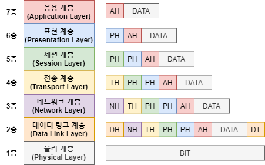

# 1. Python 네트워크 프로그래밍: 소켓(Socket) 통신 기초

## 1. 소켓 (Socket)의 개념

소켓은 네트워크를 통해 데이터를 보내거나 받는 '창구' 역할을 한다. 기기 간에 데이터를 읽거나 쓰기 위해서는 반드시 소켓을 열어야 하며, 클라이언트/서버 모델에 기초하여 통신 기기 간 대화가 가능하도록 돕는다.

* **TCP/IP의 프로그래머 인터페이스**이다.
* 통신을 할 때마다 소켓 내부적으로 TCP 프로토콜 처리를 자동으로 수행한다.
* HTTP 통신 역시 이 TCP를 기반으로 구체화시킨 프로토콜이다.
* **통신 방식 분류**:
  * 연결 지향형: TCP/IP (`SOCK_STREAM` 사용)
  * 비연결 지향형: UDP (`SOCK_DGRAM` 사용)


## 2. 소켓 통신 포트 및 IP 확인
파이썬의 내장 `socket` 모듈을 사용하여 주요 서비스의 포트 번호와 특정 도메인의 IP 주소를 확인할 수 있다.

```python
import socket 

# 주요 서비스의 TCP 포트 번호 확인
print(socket.getservbyname('http', 'tcp')) # 80 (웹 서비스)
print(socket.getservbyname('ssh', 'tcp'))  # 22 (원격 컴퓨터 접속)
print(socket.getservbyname('ftp', 'tcp'))  # 21 (파일 전송)
print(socket.getservbyname('smtp', 'tcp')) # 25 (메일 송신)
print(socket.getservbyname('pop3', 'tcp')) # 110 (메일 수신)

# 특정 웹 서버(도메인)의 IP 주소 확인
print(socket.getaddrinfo('www.naver.com', 80, proto=socket.SOL_TCP))
```


## 3. 일회용 서버/클라이언트 실습 1 (단방향 수신)
서버와 클라이언트를 각각 다른 환경(예: 서버는 VSC, 클라이언트는 Anaconda CMD 등)에서 실행하여 통신을 테스트한다.

### 서버 (Server)
```python
from socket import *

# 1. 소켓 객체 생성 (IPv4, TCP 방식 지정)
serversock = socket(AF_INET, SOCK_STREAM) 

# 2. 소켓을 특정 IP와 포트에 바인딩 (튜플 형태로 입력)
serversock.bind(('127.0.0.1', 8888)) 

# 3. 리스너 설정: 클라이언트의 연결 대기 (동시 접속 대기열 수: 5)
serversock.listen(5) 
print('서버 서비스 중...')

# 4. 연결 수락: 클라이언트의 요청이 올 때까지 대기(블로킹)하다가 수락함
conn, addr = serversock.accept() 
print('client addr : ', addr)

# 5. 메세지 수신 및 해독 (버퍼 크기 1024바이트, 수신한 바이너리 데이터를 문자열로 디코딩)
print('from client message : ', conn.recv(1024).decode()) 

# 6. 연결 및 소켓 종료
conn.close()
serversock.close()
```

### 클라이언트 (Client)
```python
from socket import *

clientsock = socket(AF_INET, SOCK_STREAM)

# 1. 능동적으로 서버에 연결 시도
clientsock.connect(('127.0.0.1', 8888)) 

# 2. 메세지 송신 (문자열을 UTF-8 바이너리로 인코딩하여 전송)
clientsock.send('안녕 반가워'.encode(encoding='utf_8', errors='strict'))

# 3. 소켓 종료
clientsock.close()
```


## 4. 일회용 서버/클라이언트 실습 2 (무한 루프 & 양방향 통신)
서버가 한 번 통신하고 종료되는 것이 아니라, `while True` 루프를 돌며 여러 클라이언트의 접속을 지속적으로 처리하고 답장(Echo)을 보내는 구조이다.

### 서버 (Server)
```python
import socket
import sys

HOST = '' # 빈 문자열을 넣으면 알아서 현재 컴퓨터의 IP 주소가 할당된다.
PORT = 7788

serversock = socket.socket(socket.AF_INET, socket.SOCK_STREAM) 

try:
    serversock.bind((HOST, PORT))
    serversock.listen(5)
    print('서버(무한 루프) 서비스 중...')
    
    while True:
        conn, addr = serversock.accept()
        print('client info : ', addr[0], ' ', addr[1])
        print('client message : ', conn.recv(1024).decode())
        
        # 메세지 송신 (클라이언트에게 답장 전송)
        reply_msg = 'from server : ' + str(addr[1]) + ' 너도 잘 지내'
        conn.send(reply_msg.encode('utf_8'))
        
except Exception as e:
    print('err : ', e)
    sys.exit()
finally:
    # 예외가 발생하더라도 열려있는 소켓은 안전하게 닫아준다.
    conn.close()
    serversock.close()
```

### 클라이언트 (Client)
```python
from socket import *

clientsock = socket(AF_INET, SOCK_STREAM)

# 능동적으로 서버 연결 시도 (포트 번호를 서버와 맞춰야 함)
clientsock.connect(('127.0.0.1', 7788)) 

# 메세지 송신
clientsock.send('안녕 반가워'.encode(encoding='utf_8', errors='strict'))

# 서버로부터 답장 수신
print('수신 자료 : ', clientsock.recv(1024).decode())

clientsock.close()
```


## 5. OSI 7계층 (OSI 7 Layer) 간단 요약


[Image of OSI 7 layer model diagram]

네트워크에서 통신이 일어나는 전체 과정을 7개의 단계로 표준화하여 나눈 모델이다. 
통신이 일어나는 복잡한 과정을 계층별로 나누어 파악함으로써, 각 단계의 역할을 명확히 하고 문제 발생 시 원인을 쉽게 찾을 수 있도록 돕는다.
