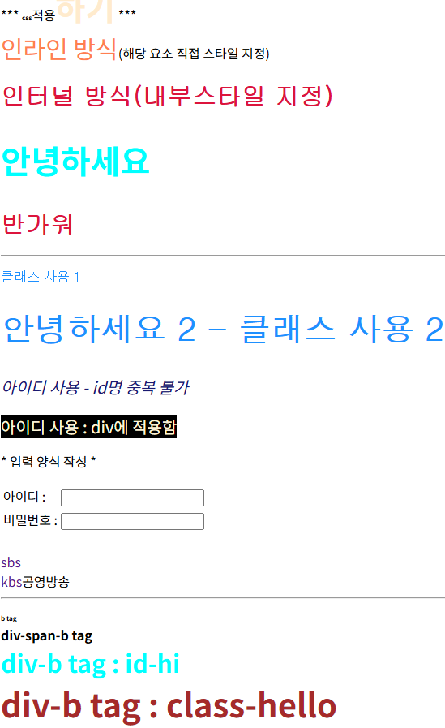

# 4. 파이썬 웹 프론트엔드 기초 (CSS)

## 1. CSS (Cascading Style Sheets) 기본 개념
HTML 문서에 다양한 레이아웃과 꾸미기를 적용하기 위한 표현적인 언어이다. 서식은 기본적으로 `선택자 { 속성: 값; }` 형태를 띤다. 부모 요소에 적용된 스타일은 기본적으로 하위 요소로 상속된다.

### 영역 지정 태그 (`<div>` vs `<span>`)
스타일을 적용하기 위해 내용물의 범위만 묶어 지정하고 싶을 때 사용한다.
* **`<div>`**: 블록(Block) 단위 요소이므로 줄바꿈이 일어나며 넓은 구역을 나눌 때 사용한다.
* **`<span>`**: 인라인(Inline) 단위 요소이므로 줄바꿈 없이 텍스트 일부 영역만 지정할 때 사용한다.

## 2. 선택자 (Selector)의 종류

* **요소(태그) 선택자**: `h1`, `p` 등 태그명을 직접 지정한다. 해당 태그 전체에 일괄 적용된다.
* **클래스(Class) 선택자**: `.클래스명` 형태로 사용한다. 속성값으로 여러 요소가 중복해서 보유할 수 있어 복수 선택 및 적용이 가능하다.
* **아이디(ID) 선택자**: `#아이디명` 형태로 사용한다. 문서 내에서 중복될 수 없는 고유한 값이어야 하므로 단수 요소 선택에 사용한다.

### 하위 및 동적 선택자

* **`div b` (자손 선택자)**: 공백을 사용하며, `div` 태그 내부에 있는 모든 `b` 태그에 적용한다. (깊이 무관)
* **`div > b` (자식 선택자)**: `>` 기호를 사용하며, `div` 태그 바로 1단계 아래에 있는 직계 자식 `b` 태그에만 적용한다.
* **동적 선택자**:
  * `input:focus`: 사용자가 입력창을 클릭하여 포커스를 받았을 때의 스타일을 지정한다.
  * `a:link`: 방문하지 않은 링크의 상태를 지정한다. (`text-decoration: none`으로 하이퍼링크의 기본 밑줄을 제거할 수 있다.)
  * `a:hover`: 마우스 커서를 요소 위에 올려두었을 때의 스타일을 지정한다.


## 3. CSS 적용 방법 및 우선순위
CSS를 적용하는 방식에는 크게 3가지가 있으며, 적용 위치가 태그와 가까울수록 우선순위가 높다.
1. **인라인(Inline) 방식**: HTML 태그 내부에 `style` 속성으로 직접 지정한다. (가장 최우선 적용)
2. **인터널(Internal) 방식**: HTML 문서의 `<head>` 영역 내에 `<style>` 태그를 만들어 지정한다.
3. **익스터널(External) 방식**: 별도의 `.css` 파일을 만들어 HTML의 `<link>` 태그로 불러온다.

> **우우선순위 요약**: 인라인 > 인터널 > 익스터널 순으로 적용된다. 만약 같은 인터널 방식 내에서 중복 선언이 발생하면, **가장 마지막(아래)에 선언한 코드**가 최종적으로 우선 적용된다 (Cascading 효과).

## 4. HTML 및 CSS 실습 코드

### HTML 파일 (index.html)
```html
<!DOCTYPE html>
<html lang="en">
<head>
    <meta charset="UTF-8">
    <meta name="viewport" content="width=device-width, initial-scale=1.0">
    <title>CSS Practice</title>
    
    <style type="text/css">
        h1 { font-size: 30px; font-family: 굴림; color: crimson; }
        h2, strong { font-size: 40px; color: blanchedalmond; } /* 다중 선택자 */
        .c1 { color: dodgerblue; font-family: 돋움, 궁서, serif, 'Times New Roman'; }
        #myid1 { color: midnightblue; font-size: 20px; font-style: italic; }
    </style>

    <link rel="stylesheet" type="text/css" href="css/ex.css">
</head>
<body>
    <hr>
    *** <b>css</b><strong>적용하기</strong> *** <br>
    
    <span style="font-size: 30px; color: coral;">인라인 방식</span>(해당 요소 직접 스타일 지정)
    
    <h1>인터널 방식(내부 스타일 지정)</h1>
    <h2 style="color: aqua;">안녕하세요</h2> 
    <h1>반가워</h1>
    <hr>
    
    <p class="c1">클래스 사용 1</p> 
    <h2 class="c1">안녕하세요 2 - 클래스 사용 2</h2>
    
    <p id="myid1">아이디 사용 - id명 중복 불가</p>
    <span id="myid2">아이디 사용 : 익스터널 CSS에 적용함</span><br>
    
    <p>* 입력 양식 작성 *</p>
    <form>
        <table>
            <tr>
                <td>아이디 : </td>
                <td><input type="text" name="id"></td>
            </tr>
            <tr>
                <td>비밀번호 : </td>
                <td><input type="password" name="pwd"></td>
            </tr>
        </table>
    </form>
    <br>
    
    <a href="https://www.sbs.co.kr/" target="tiger">sbs</a><br>
    <a href="https://www.kbs.co.kr/" target="tiger">kbs</a> 공영방송
    <hr>
    
    <b>b tag (단독)</b>
    <div><span><b>div-span-b tag (자손)</b></span></div>
    <div><b id="hi">div-b tag : id-hi (직계 자식)</b></div>
    <div><b class="hello">div-b tag : class-hello (직계 자식)</b></div>
</body>
</html>
```

### 외부 CSS 파일 (css/ex.css)
```css
/* css 파일의 주석 */
#myid2 { 
    background-color: black; 
    color: cornsilk; 
    font-size: 20px; 
}

/* 동적 선택자: 인풋 박스 클릭 시 배경색 변경 */
input:focus { 
    background-color: silver; 
}

/* 하이퍼링크 밑줄 제거 및 마우스 오버 시 색상 변경 */
a:link { text-decoration: none; }
a:hover { color: greenyellow; }

/* 선택자 계층 연습 */
b { font-size: 8px; } /* 기본 b 태그 */
div b { font-size: 16px; } /* div 태그 자손들 모두 적용 */
div > b { font-size: 26px; color: blue; } /* div 태그 직계 자식만 적용 */

/* 부모와 아이디/클래스 조합 */
div b#hi { font-size: 30px; color: aqua; }
div b.hello { font-size: 40px; color: brown; }
```

> **결과 확인**: 위 코드를 렌더링하면 선택자 우선순위와 계층 규칙(자식, 자손)에 따라 각 텍스트의 크기와 색상이 다르게 적용된 화면을 확인할 수 있다.
