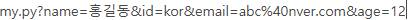

# 7. 파이썬 웹 프론트엔드 기초 (JavaScript - Part 3: 유효성 검사)

## 1. 폼 유효성 검사 (Form Validation)의 개념
사용자가 HTML 폼(Form)에 입력한 자료를 서버로 전송(`submit`)하기 전에, 자바스크립트를 이용해 데이터가 비어있지 않은지, 혹은 올바른 형식(길이, 숫자/문자 여부, 이메일 양식 등)을 갖추었는지 클라이언트 측에서 미리 점검하는 과정이다. 
불필요한 서버 통신을 줄이고 사용자에게 즉각적인 피드백을 줄 수 있어 매우 중요하다.

### 주요 검사 메서드
* **`event.preventDefault()`**: Submit 버튼을 눌렀을 때 페이지가 무조건 넘어가버리는 고유 기능을 일단 중단시킨다.
* **`isNaN(값)`**: 입력된 값이 숫자가 아닌지(Not a Number) 판별한다. 문자열이면 `true`, 숫자면 `false`를 반환한다.
* **`element.focus()`**: 입력값이 조건에 맞지 않아 에러 알림을 띄운 후, 사용자가 바로 수정할 수 있도록 해당 입력칸(Input)으로 마우스 커서를 자동으로 이동시킨다.
* **`form.submit()`**: 자바스크립트로 모든 검사를 무사히 통과했을 때, 마지막에 수동으로 서버로 자료를 전송하는 명령어이다.


## 2. 정규표현식 (Regular Expression) 기초

문자열에서 특정한 규칙(패턴)을 가진 단어를 찾거나, 입력 형식을 검사할 때 사용하는 강력한 도구이다. 자바스크립트에서는 `/패턴/플래그` 형태로 사용한다.

### 문자열 검색 실습 (`match` 함수 활용)
`str.match(정규표현식)`은 조건에 맞는 문자열을 찾아 배열 형태로 반환한다.
* `g` (global) 플래그: 문자열 전체에서 일치하는 모든 값을 찾는다.
* `i` (ignore case) 플래그: 대소문자를 구분하지 않는다.

```javascript
let str = "123Abc가나다45김 asdf 23길동";

console.log(str.match(/[1]/g));       // ['1'] (문자 '1' 찾기)
console.log(str.match(/[0-9]/g));     // ['1', '2', '3', '4', '5', '2', '3'] (모든 숫자 낱개 찾기)
console.log(str.match(/\d/g));        // 위와 동일 (\d는 숫자를 의미)
console.log(str.match(/[0-9 ]/g));    // 숫자와 공백(스페이스) 찾기
console.log(str.match(/[가-힣]/g));    // 모든 한글 낱자 찾기
console.log(str.match(/[가-힣]+/g));   // ['가나다', '김', '길동'] (+는 1개 이상 뭉쳐있는 덩어리 찾기)
console.log(str.match(/\d{2,3}/g));   // ['123', '45', '23'] (숫자가 2자리 ~ 3자리 연속된 것 찾기)
```

## 3. 회원가입/입력 폼 유효성 검사 실습
이름, 아이디, 이메일, 나이를 입력받고 조건에 맞는지 확인한 뒤, 모든 조건이 만족될 때만 `my.py`로 자료를 전송하는 자바스크립트 코드이다. (디자인은 부트스트랩 클래스를 활용했다.)

### HTML + JavaScript 전체 코드
```html
<!DOCTYPE html>
<html lang="ko">
<head>
    <meta charset="UTF-8">
    <meta name="viewport" content="width=device-width, initial-scale=1.0">
    <title>유효성 검사 실습</title>
    <link href="[https://cdn.jsdelivr.net/npm/bootstrap@5.3.3/dist/css/bootstrap.min.css](https://cdn.jsdelivr.net/npm/bootstrap@5.3.3/dist/css/bootstrap.min.css)" rel="stylesheet">
    
    <script>
        window.onload = () => {
            document.querySelector("#btnSend").onclick = chkData;
            document.querySelector("#btnClear").onclick = clsData;
        }
        
        // 자료 전송 버튼 클릭 시 실행될 함수
        function chkData(event) {
            // 1. 기본 전송 기능 차단
            event.preventDefault();

            // 2. 이름 검사: 빈칸이거나, 숫자를 입력했을 경우 에러
            if(frm.name.value === "" || isNaN(frm.name.value) === false) {
                alert("정확한 이름을 입력하세요 (숫자 입력 불가)"); 
                frm.name.focus(); // 커서 이동
                return; // 에러가 났으므로 함수(검사) 즉시 종료
            }
            
            // 3. 아이디 검사: 3글자 미만일 경우 에러
            if(frm.id.value.length < 3) {
                alert("id는 3글자 이상 입력하세요");
                frm.id.focus();
                return;
            }
            
            // 4. 이메일 검사 (정규표현식 활용)
            // 해석: 시작(^) 영어/숫자/._- @ 영어/숫자/.- . 영어 2~4글자 끝($)
            let email_regex = /^[a-zA-Z0-9._-]+@[a-zA-Z0-9.-]+\.[a-zA-Z]{2,4}$/i;
            if(!frm.email.value.match(email_regex)) {
                alert("이메일 형식에 맞지 않습니다.");
                frm.email.focus();
                return;
            }
            
            // 5. 나이 검사 (정규표현식 활용)
            // 해석: 시작(^) 숫자 1자리에서 2자리 끝($)
            let age = /^[0-9]{1,2}$/;
            if(!frm.age.value.match(age) && frm.age.value > 0) {
                alert("나이는 1~2자리의 숫자로 입력하세요.");
                frm.age.focus();
                return;
            }
            
            // 6. 모든 유효성 검사를 통과했다면 실제 서버로 전송 처리
            frm.action = "my.py";
            frm.method = "get";
            frm.submit(); // 강제 제출
        }

        // 폼 초기화 후 커서를 이름 칸으로 이동
        function clsData(event) {
            document.querySelector("#name").focus(); 
        }
    </script>
</head>
<body>
    ** 개인 자료 입력 **<br/>
    <form name="frm">
        <table class="table table-dark table-hover">
            <tr>
                <td>이 름</td>
                <td><input type="text" name="name" id="name" value="홍길동"></td>
            </tr>
            <tr>
                <td>아이디</td>
                <td><input type="text" name="id" id="id" placeholder="3글자 이상" value="kor"></td>
            </tr>
            <tr>
                <td>이메일</td>
                <td><input type="text" name="email" id="email" placeholder="example@test.com"></td>
            </tr>
            <tr>
                <td>나이</td>
                <td><input type="number" name="age" id="age"></td>
            </tr>
            <tr>
                <td colspan="2" style="text-align: center;">
                    <input type="submit" id="btnSend" value="자료 전송" class="btn btn-primary">
                    <input type="reset" id="btnClear" value="자료 삭제" class="btn btn-info">
                </td>
            </tr>
        </table>
    </form>
</body>
</html>
```

[결과]
